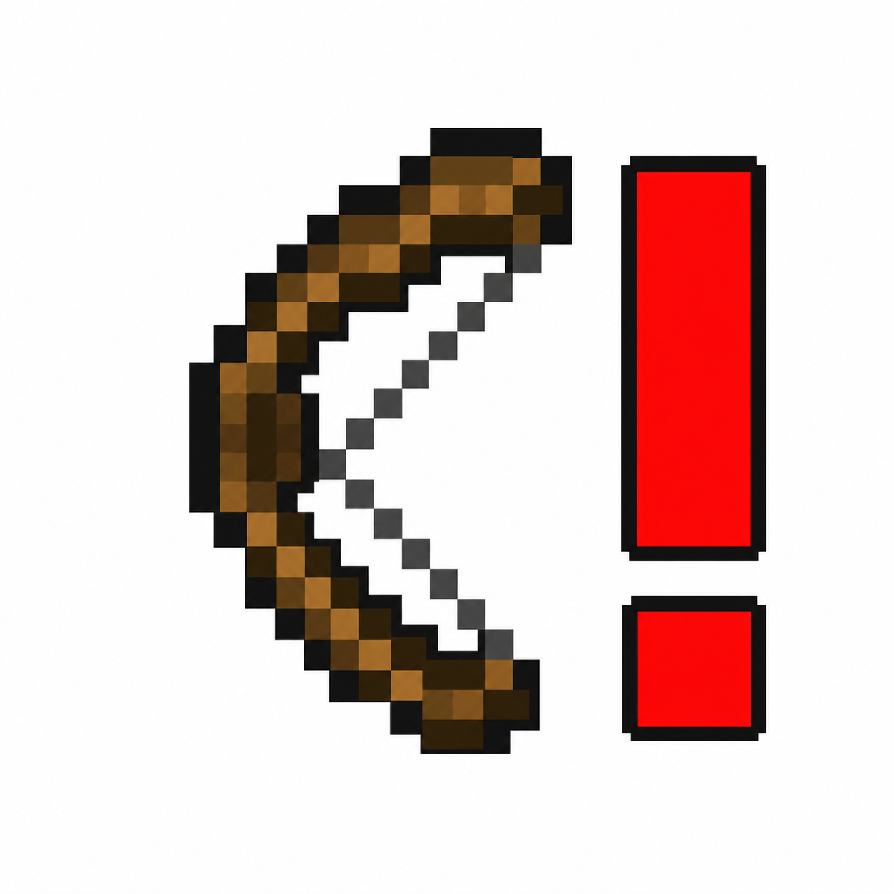

# Bow Alert



Bow Alert 是一个 Fabric 客户端预警模组。附近实体手持弓、弩或投掷类物品并大致朝向你时，它会在准星上方 30px 显示威胁图标。

## 用法

安装 Fabric Loader、Fabric API 与本模组后进入游戏即可，无需命令或额外配置。

- 检测半径为 50 格；中间有方块遮挡也会预警。
- 判定使用实体眼部视线和玩家动态扩展后的碰撞箱。距离越远，允许的偏差越大，最大不会把固定五格区域一概当作玩家。
- 弓按敌人的实际拉弓阶段显示原版弓材质；拉满时显示红色感叹号。
- 弩会显示上膛或未上膛状态；已上膛时显示红色感叹号。
- 多个目标同时朝向你时，显示威胁最高的一个，并以 `×N` 标示总数。满弓、已上膛弩与可立即投掷物优先；同级时更近者优先。

## 版本状态

- Minecraft 1.21.11
- Minecraft 26.2

## 构建

```powershell
.\gradlew.bat build '-PmcTarget=1.21.11'
```

创建 `v*` 格式的 Git 标签后，GitHub Actions 会构建两个版本并作为 GitHub Release 附件发布，同时同步上传到 [Modrinth](https://modrinth.com/mod/bowalert)（仓库需配置 `MODRINTH_TOKEN` Secret）。
